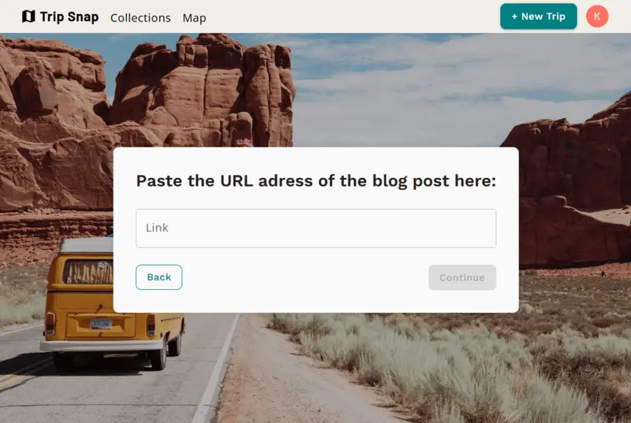
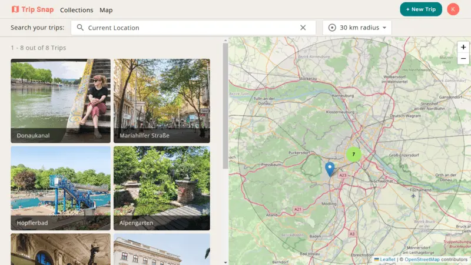
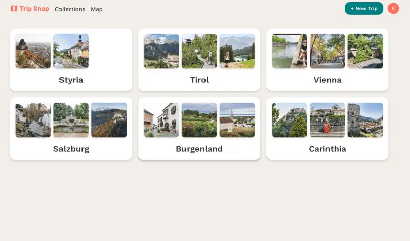
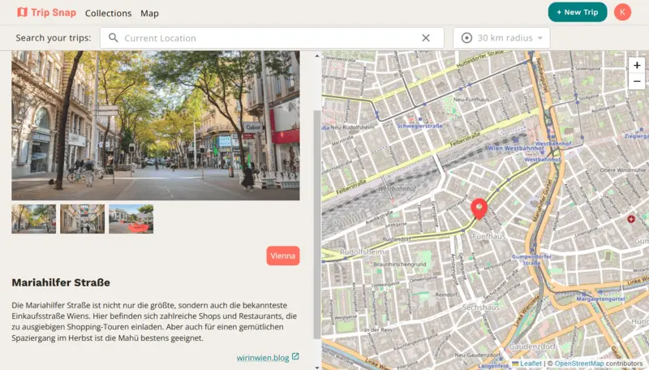

# Trip Snap

# Travel Inspiration App

This project allows users to save tips from travel blogs, organize them in collections, and view them on an interactive map. Whether you're planning a trip or gathering ideas, this app lets you easily manage and explore your travel inspiration.

## Features

1. **Save Travel Inspiration**  
   Easily save destinations, activities, and tips from travel blogs and articles. Store valuable details for future trips.
   
   

3. **Interactive Map**  
   Add your saved cards to the map for a clear overview of your plans. Use **OpenStreetMap** and **Leaflet** to visualize locations in real-time.
   

4. **Build Collections**  
   Group destinations into trips or thematic collections such as "Wandering in the Alps" or "City Life in Vienna". Organize your inspiration into customized collections.
   
   

6. **Filter and Explore**  
   Narrow down your trips based on location, distance, or type of adventure. Find what excites you most by applying various filters.
   
   

## Tech Stack

- **React**: For building the user interface with a dynamic, component-based approach.
- **Material-UI (MUI)**: For styling and providing UI components like buttons, forms, and grids.
- **OpenStreetMap & Leaflet**: For rendering the interactive map that shows the saved destinations and activities.
- **Firebase**: For storing and syncing data, including the saved destinations, activities, and collections.
- **Scraper Script**: Custom script used for extracting data from travel blog posts and articles to populate the app with inspiration.
- **Zod**: For input validation and ensuring that the data follows the expected structure and types.
- **TypeScript**: For statically typed JavaScript, improving the reliability and maintainability of the codebase.
- **Vite**: A fast development build tool, providing fast reloads and optimized production builds.
- **Nominatim Autocomplete**: For providing location autocomplete suggestions when adding destinations or searching for locations.
